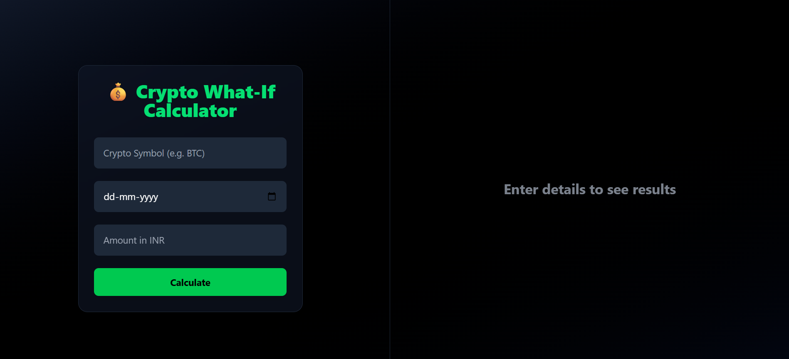
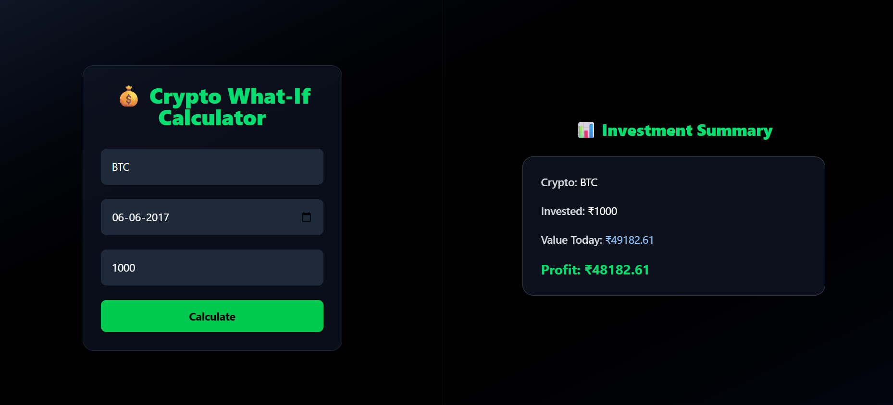

### Crypto What-If — Monorepo (Frontend + Backend)

This repository contains both the React + Vite frontend and a Node.js backend for the Crypto What-If app. The app lets users input cryptocurrency investment details and visualize hypothetical results.

### Repository Structure
- `frontend/`: React + Vite application (UI)
- `backend/`: Node.js server (API)

### Folder Structure

Frontend (`frontend/`)

```text
frontend/
│
├── package.json
├── index.html
├── eslint.config.js
├── vite.config.js
│
├── public/
│   ├── images/
│   │   ├── afterdetails.png
│   │   └── homepage (2).png
│   └── vite.svg
│
└── src/
    ├── main.jsx
    ├── App.jsx
    └── assets/
        └── react.svg

```

Backend (`backend/`)

```text
backend/
│
├── package.json
└── server.js

```

### Prerequisites
- Node.js 18+ and npm

### Quick Start
Open two terminals (one for backend, one for frontend).

Backend
1. `cd backend`
2. `npm install`
3. `npm start` (or `node server.js` if no start script)
4. The server should start on its configured port (check `server.js`).

Frontend
1. `cd frontend`
2. `npm install`
3. `npm run dev`
4. Open the URL shown in the terminal (typically `http://localhost:5173`).

### Scripts
Backend (from `backend/`):
- `npm start`: start the server

Frontend (from `frontend/`):
- `npm run dev`: dev server with HMR
- `npm run build`: production build
- `npm run preview`: preview built app

### Screenshots
Homepage



After entering details (results shown)



### Development Notes
- Static assets for README screenshots live under `frontend/public/images/`.
- If ports conflict, adjust the backend port in `backend/server.js` and the frontend dev server (Vite) via `frontend/vite.config.js`.
- Ensure CORS is configured on the backend if the frontend calls it from a different origin during development.

### Project Goals
- Fast, responsive UI for “what-if” crypto scenarios
- Clear input of coin, amount, timeframe
- Accurate, easy-to-read result display

### Tech Stack
- Frontend: React 18 + Vite
- Backend: Node.js

